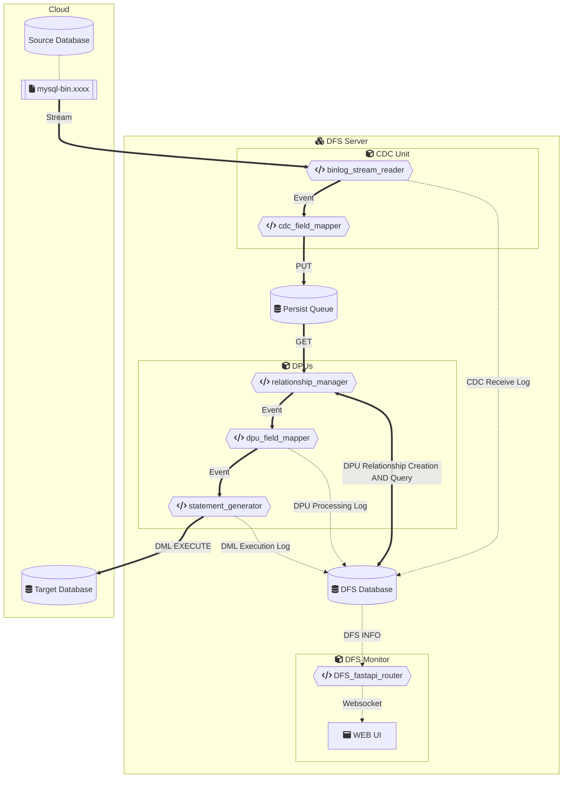

mysql-dataflowsync(DFS)
===

# DFS Workflow



Edit on mermaid.live: [DFS workflow](https://mermaid.live/edit#pako:eNqVVX9vokAQ_Sqb_esu0ea01lpyvaSKNU20p0XTy5WGrDDg5oAly9LWWr_7zUL9hVzMYWIWeDPz5r2dZUVd4QE1qB-KV3fBpCJ2TPBKs3kgWbIgNr0J-TKLbVq80Jdldp--2NQSmXSBmEyxOUvBpl-fd5ju8OnJpj4zfFb3eQiky-NQBMRSElhk0-fng3ykflbHmOIZxF6xOOJS5HOzOaTEHI2JBfIF5D63SjDpmT0yi7naRxYsrdVqi0QpyDyn6aQ5TQf_PJ1_vT6Mux01SnGu5zo-h9BzIpYkVTHdIbm-_qFLHnHIX3zYtP8CMXL80Pl3oK0cO0kOVxPtRsHF-zSDjEGmPFVkkkFWsmZY2FcK0HJWW7lbIa0N1fFsqolOqmDVHpjjWVrW_2FUklFCyBQXcbrgCSoZs6Ba_mYpzkuyE_Jbg1JIqpiCCAV3AohBMiWqKx2ZYw3KTVT41zzp32QTNejnUj6M_kNLNGskcEMLeSTpdLQdvFcee-K1HrE3HvF3II_9Lpnd4fAdhtyM78pyRonjM1Qo4Y4UmaoS9GSDw2Ks8x414bv725-6USy3ff4I81S4fyBXDanvHyDWFqXH9wFc4C9AhiLQWEy-w6ID3z_FxF2G0N0mIj2cYX1Dbu5NPQ1yeRSuTd4SxfixFC6kKY-DymrWYK-tIem_gZvlFarAp06049N1WjmeUyYDUP-YUGS0aV8T-tXvzaZ9TWW6oYIECK3RCGTEuIcH_ko_t6la4AjY1MClBz7LwvyIXCOUZUpYy9ilhpIZ1Chug2BBkVOY4l2WIDMwOcM-og0EPL0hR8UXJf-w1GjCYmqs6Bs1mleXZ83GRfP8qtFqX16ct2t0SY36xVm70zpvNTqd9rcO_ppQb7TWNfouBCZu5Bl-52tdZP0XzXblyg)

# Environment Requirements
- System: Linux or macOS
- Network: whitelisted IP specified by the source database, and unchangeable
- DFS database: MariaDB 11.4.x
- Source database: MySQL 5.7.x (Binlog enabled, and `binlog-format = ROW`)
- Target database: MySQL 8.0.x
- Python: 3.12
- Python library: [requirements.txt](requirements.txt)

# Installation

```bash
docker build -t mysql-dataflowsync:latest .
docker compose up -d
```

# Performance

> Configuration: Using a 2022 M2 MacBook Pro (16GB), Python 3.12

##  CDC (Change Data Capture) Unit

A change data capture unit implemented using the Python `mysql-replication` and `persist-queue` libraries.

CDC processing speed: `Maximum` 59 records per second (`MAX 59rps`) on a single node, with an average of `17ms` per record.

##  DPU (Data Processing Unit)

Custom Data Processing Unit for unidirectional data synchronisation between two databases.

DPU processing speed: in the case of a single node, the maximum processing `18` records per second (`MAX 18rps`), the average `55ms` processing a record.

# License
This project is licensed under the MIT License.

# References
- [python-mysql-replication](https://github.com/julien-duponchelle/python-mysql-replication) - Apache License, Version 2.0
- [persist-queue](https://github.com/peter-wangxu/persist-queue) - BSD-3-Clause license
