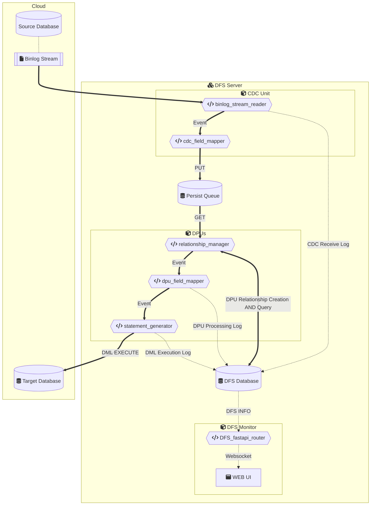

mysql-dataflowsync(DFS)
===

[简体中文](./README_zh-CN.md)

# What is DFS?
DFS is a data synchronisation framework that implements data capture by streaming reads of mysql binlogs, targeting either mysql or other databases. The framework consists of a millisecond incremental data capture module (CDC), a persistent queue [persist-queue](https://github.com/peter-wangxu/persist-queue) based on a sqlite database, an automatic relational processing module (rel_mgr), and a business logical complex data transformation module (DPU) using [dfs-entrypoint.py](./dfs-entrypoint.py), which can be called in any combination. In a clustered database with an average daily load of 75,000 events, incremental data synchronisation can be completed with a latency of seconds (average latency of less than 1 second), while maintaining data integrity and consistency.


# DFS Usage Scenarios

  - Used for **Data Synchronisation** - Used for data synchronisation when the table structure of the source database and the target database are consistent.

  - Used for **Data Pipeline** - Used for data synchronisation when the table structure of the source database and the target database are inconsistent, after DPU custom table structure mapping and data processing, data pipeline function can be achieved.

  - Used for **Data Backup** - without setting the target database, use the built-in DFS log database to achieve the incremental data event backup function.

# DFS Workflow



Edit on mermaid.live: [DFS workflow](https://mermaid.live/edit#pako:eNqVVWtv2jAU_SuWP20SoJBBKdE6qTyKKpEOGlCnNRUyyU2wlsSRk9AH5b_vOilQQia0fIgc-9x7j8_xdTbUES5Qg3qBeHZWTKbEjgg-Sbb0JYtXxKb9QGSuTYt59ViD3uMXm1oikw6QAUvZkiVg069PB0xv_PhoU48ZHqt7PADS41EgfGKlElho06eno3yk3qhjTDEHkVsMTqgU-ZxsCQkZ3FjEArkG-ZlbJZj0B30yj3j6GVmwtDabPRKVIMuc5iLJaS7w5ar82-1x3I3ZLMU5rrPwOATuImRxXBXTG5Orqx-q5AmHfOHdpsM1RMjxXeU_gPZyHCQ5Hk2VGwUX98MMMgGZ8CQl0wyykjXjwr5SgJKz2srDCGntqE7mM0V0WgWr9mAwmSdl_e_NkowSApZyESUrHqOSEfOr5ddLcW6cnZHfGpVCkpSlEKLgCx8ikCwV1ZVOzLFG5U1U-Kef9W-6ixoNcynvzf_QEs0yBR5oIU8knZn7xnvmkSue6yF74SF_A_Iw7JH5LTbfccj15LakDeZfeAwVivlCiiytEvTsBsdFW-d7VIRv725-qo1iuf38AywT4fyBXDWk_vkCsfYo1b734ABfAxkLX2Ex-QGLDnz_EBNPGUIPh4j0sYfVB7m-G6hukK8n4crkPVGMn0jhQJLwyK-sZo0OaHNMhi_gZHmFKvC5G-3kcp1VdueMSR_SfzQoEtrtXvH5NezPZ0PFZLZjgvUJrdEQZMi4i9f9Rs3bNF1hB9jUwKELHsuC_IbcIpRlqbBeI4caqcygRvEU-CuKnIIEv7IYmcGAM9xGuJ8FVx1Is_ih5P-VGo1ZRI0NfaGG3tUbneZlS7_o6pea1m7W6Cs1Wo2WdtHuaF1du7hstdqtbY2-CYFJtUa30-x-09Vas6N1mu082-98UZHa_gXKvubx)

# Tested environment
- Source Database: MySQL 5.7.x (with binlog turned on and `binlog-format = ROW`)
- Target database: MySQL 8.0.x
- Python version: 3.12+
- Python library: [requirements.txt](./requirements.txt)

# Installation

1. Modify `config.example.yaml` as necessary and rename it to `config.yaml`.
    > If you want to specify the binlog file and binlog location, set `binlog_file` and `binlog_pos` in `config.yaml`.

2. Build and start the container

    ``bash
    docker build -t mysql-dataflowsync:latest .
    docker compose up -d
    ```

# Performance

> Configuration: Using a 2022 M2 MacBook Pro (16GB), Python 3.12, source database is MySQL 5.7.x (PolarDB), target database is MySQL 8.0.x (PolarDB)

##  CDC (Change Data Capture) Unit

A change data capture unit implemented using the Python `mysql-replication` and `persist-queue` libraries.

CDC processing speed: `Maximum` 59 records per second (`MAX 59rps`) on a single node, with an average of `17ms` per record.

##  DPU (Data Processing Unit)

Custom Data Processing Unit for unidirectional data synchronisation between two databases.

DPU processing speed: in the case of a single node, the maximum processing `18` records per second (`MAX 18rps`), the average `55ms` processing a record.

# License
This project is licensed under the MIT License.

# References
- [python-mysql-replication](https://github.com/julien-duponchelle/python-mysql-replication) - Apache License, Version 2.0
- [persist-queue](https://github.com/peter-wangxu/persist-queue) - BSD-3-Clause license
