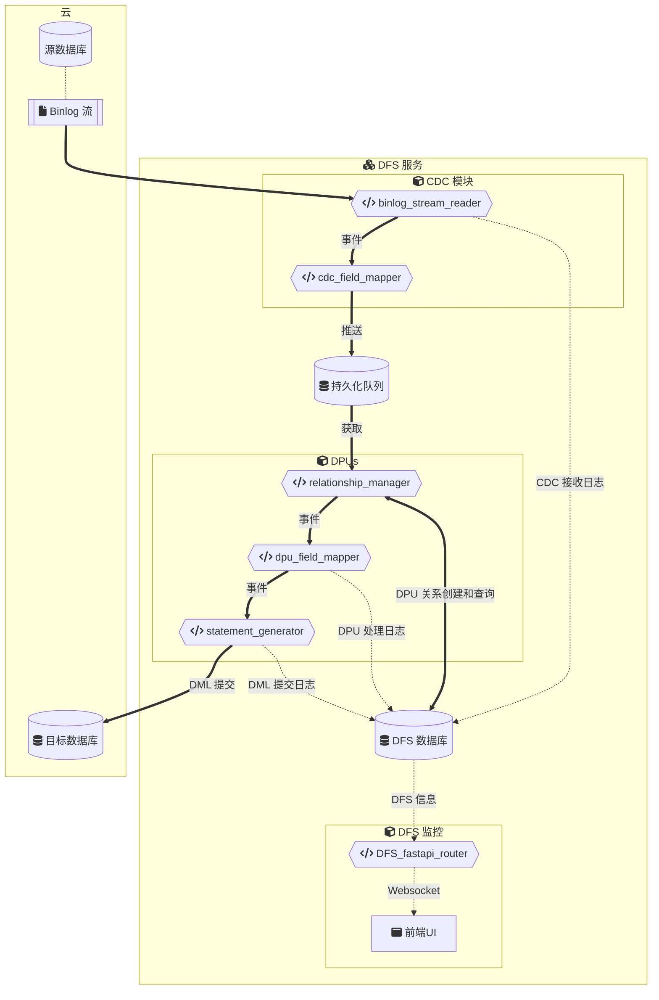

mysql-dataflowsync(DFS)
===

[English](./README.md)

# DFS 介绍

DFS是一个数据同步框架，通过流式读取mysql binlog实现数据捕获，目标数据库可以是mysql，也可以是其他数据库。这个框架由一个毫秒级的增量数据捕获模块（CDC）、基于sqlite数据库的持久化队列 [persist-queue](https://github.com/peter-wangxu/persist-queue)、自动关系处理模块（rel_mgr）以及符合业务逻辑的、复杂的数据转换模块（DPU）构成，使用 [dfs-entrypoint.py](./dfs-entrypoint.py) 启动，可以自由组合调用。在一个日均7.5万事件负载的集群数据库中，增量数据同步能够在秒级延迟内完成（平均延迟1秒内），同时保持了数据的完整性和一致性。

# DFS 使用场景

  - 用于**数据同步** - 用于源数据库与目标数据库表结构一致情况下的数据同步。

  - 用于**数据管道** - 用于源数据库与目标数据库表结构不一致情况下的数据同步，经过DPU自定义表结构映射与数据加工，可实现数据管道功能。

  - 用于**数据备份** - 不设置目标数据库，使用内置的DFS日志数据库，实现增量数据事件备份功能。


# DFS 工作流



在 mermaid.live 上编辑: [DFS workflow](https://mermaid.live/edit#pako:eNqVVe1L20Ac_leO-7RBW5qkrbXMwWpRhBamqQxmpFybaxvWvJCk-FILK8zNbVp1L3bghnMoEwY6kDlWP_jPNKn-F7ska2rTSFk-lOvd89zvuefJ71KDBZnHMAGLFXmpUEaqDjgJkEer5ksqUsqAg532LgedWethU8mFexw02zvmx5_m1qnRfs_B-4t9QDK9sMDBIkoUUbAoVDBIClJFLgHzV4ODi4sDO4FgKEgIzhyWeGcwJMHZrFDNYw2kplhgft4y3hzeVuULBpOpSWCeHBpfWrexjki2VnOxxAOQt1XmNF3FSMyRHx6rHKzXB3lTGcrDK_CFXFHAFT4nIkXx4yTTYGLioVVySIO9sGZ5_LZzecHBNatAH-U60ndlcDRrReGI4ZGO8kjDwNxsdP6sG5t7N58OjI3WYDhpJz0PxfbUP83-iCjryTWbJzfPG5bcWT-kfxipx_OaN4a5jMdNFVeQLsiSVhYUYqiESv4p0B4er1RHpMBOeyiajnQsYknPlbCEVaTL_pWGM2Knvafwy5EemeNsj3bd_G1s71m0ucx_GEpS6-7vms3vQ7ZmM24LLgkSLy8FRbQsiMIqBsbrre6Ps_kZ0ouDpEePZzwOkQK5IiI-KUJOlau6n60jD5l2utw-p6W4c3VoNs6ss5KC7soTnNfkwjOs2yZkM7evE9ZF2f3cPDY_XJitY-OqZYHJ_n0wSeLBP0_J6waM9fPu-aWxsW9cto13m-bB8fXZtyGSlbGr0GIdvejuvLyjAjvdx2bSwNze6bSP7sCOutY8N2vWtze7-6fm11d3dCdR0zuuK8aSke3JIMUBDEARqyISeHLR16x5Dupl8upzMEGGPC6iakW3lNQJFFV1mV2RCjChq1UcgCT4UhkSSRWN_KsqRBhOCYicQXRnMS-Q7sk4nxL7ixKACpJgogaXYYIap0JjYZqmqFg0wkToWDQAV2AiSEVCTHSMYsaYcIRhIky8HoCrsky2DYficZqJxuI0HRkPx8Zpyt7vqb1oyar_BZ9OI2I)

# 已测试环境
- 源数据库: MySQL 5.7.x（打开binlog，且`binlog-format = ROW`）
- 目标数据库: MySQL 8.0.x
- Python 版本: 3.12+
- Python 库: [requirements.txt](./requirements.txt)

# 安装

1. 按需修改 `config.example.yaml` 并重命名为 `config.yaml`
    > 如需指定binlog文件与binlog位置，请在 `config.yaml` 中设置 `binlog_file` 与 `binlog_pos`。

2. 构建并启动容器

    ```bash
    docker build -t mysql-dataflowsync:latest .
    docker compose up -d
    ```

# Performance

> Configuration: Using a 2022 M2 MacBook Pro (16GB), Python 3.12, source database is MySQL 5.7.x (PolarDB), target database is MySQL 8.0.x (PolarDB)

##  CDC (Change Data Capture) Unit

A change data capture unit implemented using the Python `mysql-replication` and `persist-queue` libraries.

CDC processing speed: `Maximum` 59 records per second (`MAX 59rps`) on a single node, with an average of `17ms` per record.

##  DPU (Data Processing Unit)

Custom Data Processing Unit for unidirectional data synchronisation between two databases.

DPU processing speed: in the case of a single node, the maximum processing `18` records per second (`MAX 18rps`), the average `55ms` processing a record.

# License
This project is licensed under the MIT License.

# References
- [python-mysql-replication](https://github.com/julien-duponchelle/python-mysql-replication) - Apache License, Version 2.0
- [persist-queue](https://github.com/peter-wangxu/persist-queue) - BSD-3-Clause license
